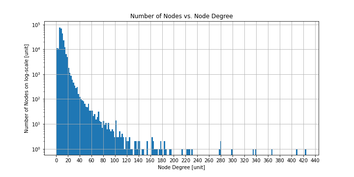
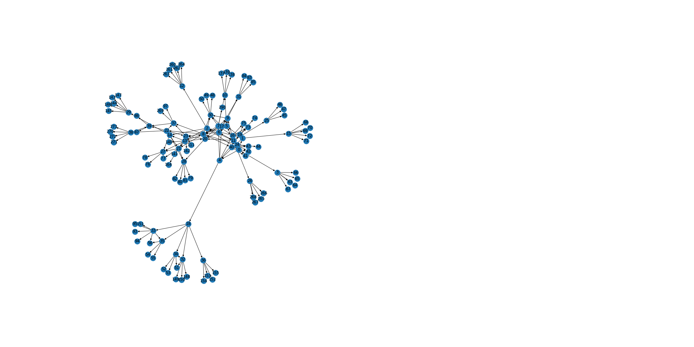

# graphx-network-analysis

<a href="https://nbviewer.org/github/mark-antal-csizmadia/graphx-network-analysis/blob/main/graphx-network-analysis.ipynb">
	
</a>

Graph analysis for recommendations with GraphX and GraphFrames in Python with PySpark. The goal is to use a data set of historical product co-purchases to recommended products for future co-purchases.

## Setup
Clone the repository. Then, make a ```conda``` environment and install the requirements, as discussed in the [official docs](https://conda.io/projects/conda/en/latest/user-guide/tasks/manage-environments.html), and start a Jupyter Notebook. Make sure that the [environment is visible in Jupyter](https://stackoverflow.com/a/44786736/11670378).
```bash
conda env create -f environment.yml
conda activate spark-env
jupyter notebook
```

## Data

The graph analysed is a Product co-purchasing network by Amazon, available at [Stanford Large Network Dataset Collection](http://snap.stanford.edu/data/#amazon). For more details, check the readme in the data folder, or the notebook.
The graph comprises nodes representing products, and directed edges representing co-purchases. Co-purchases are directed, i.e.: after buying a book, the user also bought a CD.


## Run

Open the notebook titled ```graphx-network-analysis.ipynb``` that provides detailed instructions on how to run the code. The notebook also provides code to automatically set up the data for analysis.

## Results

Some results include the number of nodes vs. degree (in and out) distributions, shown below.



A sub-graph (of 200 nodes) is visualized with [NetworkX](https://networkx.org/), as shown below:



Intermediate results as CSV files are as follows:
- degree analysis of the graph is at ```assets/degrees_df.csv```
- triangle counts are at ```assets/traingle_count_df.csv```
- pagerank analysis is at ```assets/pagerank_df.csv```
- detected communities via the Label Propagation Algorithm are at ```assets/community_df.csv``` with the community counts at ```assets/community_counts_df.csv```


Recommendations for co-purchasing are made by either the Label Propagation Algorithm (LPA) or based on the Jaccard Similarity (JS).
- The LPA is used to detect communities within the graph. Members of the same community share the same label. Given a product, the members of its community are ranked based on the average review score (```reviews``` column). The top 5 (or fewer) are the recommendations.
- The JS is used to derive a similarity measure between a product and its neighbours within the graph. The neighbours of a node are the nodes to which a directed edge leads from the node. The JS score is computed between the neighbours of a given product. The 5 (or fewer) recommendations of a given product are its neighbours with the highest JS score and then the highest average review. 

The product with ID 10 is:

|FIELD1|id   |title                                                                        |group|salesrank|reviews|
|------|-----|-----------------------------------------------------------------------------|-----|---------|-------|
|0     |10   |The Edward Said Reader                                                       |book |220379   |4.0    |

The LPA (max_iter = 5) co-purchase recommendations of the product with ID 10 are:

|FIELD1|id   |title                                                                        |group|salesrank|reviews|label              |
|------|-----|-----------------------------------------------------------------------------|-----|---------|-------|-------------------|
|0     |11699|Getting to the Better Future: A Matter of Conscious Choosing                 |book |552678   |5.0    |11701              |
|1     |5554 |The Decameron                                                                |book |441660   |5.0    |11701              |
|2     |11700|Middlemarch (Wordsworth Collection)                                          |book |1216188  |4.5    |11701              |
|3     |11698|Food Folklore : Tales and Truths About What We Eat (The Nutrition Now Series)|book |779866   |0.0    |11701              |
|4     |13805|Great Overtures in Full Score                                                |book |801312   |0.0    |11701              |

The JS co-purchase recommendations of the product with ID 10 are:

|FIELD1|id   |title                                                                        |group|salesrank|reviews|jaccard            |
|------|-----|-----------------------------------------------------------------------------|-----|---------|-------|-------------------|
|0     |137  |Apples of Gold: A Six-Week Nurturing Program for Women                       |book |129355   |5.0    |0.42857142857142855|
|1     |139  |The Sacred Impulse                                                           |book |846457   |3.0    |0.42857142857142855|
|2     |7    |Batik                                                                        |music|5392     |4.5    |0.1111111111111111 |
|3     |5    |Prayers That Avail Much for Business: Executive                              |book |455160   |0.0    |0.1111111111111111 |
|4     |138  |The McClurkin Project                                                        |music|54277    |4.0    |0.0                |

The product with ID 12345 is:

|FIELD1|id   |title                                                                        |group|salesrank|reviews|
|------|-----|-----------------------------------------------------------------------------|-----|---------|-------|
|0     |12345|Maya                                                                         |music|64984    |5.0    |

The LPA (max_iter = 5) co-purchase recommendations of the product with ID 12345 are:

|FIELD1|id   |title                                                                        |group|salesrank|reviews|label|
|------|-----|-----------------------------------------------------------------------------|-----|---------|-------|-----|
|0     |5381 |Noah'S Ark (Little Bible Playbooks)                                          |book |399319   |5.0    |10508|
|1     |10508|The V Zone : A Woman's Guide to Intimate Health Care                         |book |352991   |5.0    |10508|
|2     |17238|Q's Jook Joint                                                               |music|5440     |4.5    |10508|
|3     |10509|Tchaikovsky: Piano Concerto No. 1; The Nutcracker (Excerpts)                 |music|76777    |4.5    |10508|
|4     |10510|Tristana (Easy Readers Series B/Spanish)                                     |book |991608   |4.0    |10508|

The JS co-purchase recommendations of the product with ID 12345 are:

|FIELD1|id   |title                                                                        |group|salesrank|reviews|jaccard|
|------|-----|-----------------------------------------------------------------------------|-----|---------|-------|-------|
|0     |17238|Q's Jook Joint                                                               |music|5440     |4.5    |0.2857142857142857|
|1     |13137|Beggar's Ride (Beggars Trilogy (Paperback))                                  |book |322234   |3.0    |0.2857142857142857|
|2     |12344|The Use and Abuse of Books: De Commodis Litterarum atque Incommodis          |book |581060   |0.0    |0.2857142857142857|
|3     |10510|Tristana (Easy Readers Series B/Spanish)                                     |book |991608   |4.0    |0.125  |
